# 城投领峯 8-1-2701 家庭生活用品收纳规划

> 依据文件：`城投领峯8栋1单元2701下单图.pdf`  
> 适用目标：搬新家时，把生活用品按“使用频率、使用场景、家庭成员、儿童可达安全”归位，减少入住后的二次返工。

## 一、总原则

### 1. 按动线放，不按物品类别硬塞

家里最舒服的收纳不是“所有同类物品放一起”，而是“在哪里用，就放在哪里附近”。

- 出门用：鞋柜、玄关附近。
- 吃喝用：餐边柜、冰箱旁。
- 做饭用：厨房对应操作区。
- 洗衣清洁用：洗衣机柜、阳台/家政位。
- 学习办公用：书房。
- 儿童日常用：儿童房低位、客厅低位玩具区。
- 囤货和低频物品：高柜、顶柜、深柜。

### 2. 每个柜子分四层

- 眼睛到胸口高度：每天用，最好拿。
- 腰到膝盖高度：较常用，适合抽屉、篮筐。
- 膝盖以下：重物、孩子可自主拿的安全物品。
- 头顶以上：换季、囤货、纪念品、备用件。

### 3. 儿童用品遵守“低位开放，高位安全”

- 孩子能自己拿：绘本、玩具、画材、常穿衣服、书包。
- 孩子不能随手拿：药品、剪刀、清洁剂、玻璃杯、工具、电池。
- 家里有大面积黑板时，粉笔、板擦、磁贴可以做一个“低位学习篮”，但湿巾、清洁喷雾建议成人保管。

---

## 二、图纸页与空间对应

| 图纸页 | 空间/柜体 | 建议定位 |
|---|---|---|
| 第 1 页 | 鞋柜、沙发后储物柜、洗衣机柜相关 | 玄关出门区、客厅公共收纳、家政清洁 |
| 第 2 页 | 餐边柜、冰箱位 | 饮品、零食、小家电、餐具备品 |
| 第 3 页 | 餐边柜对面储物柜 | 公共杂物、文件、囤货补充区 |
| 第 4 页 | 主卧床尾衣柜 | 主卧衣物、被褥、换季衣物 |
| 第 5 页 | 主卧床旁衣柜、梳妆台 | 日常穿搭、护肤化妆、首饰配饰 |
| 第 6-9 页 | 书房平面与 A/B/C 面 | 办公、学习、书籍、儿童手工与资料 |
| 第 10 页 | 儿童房衣柜 | 儿童衣物、校服、被褥、成长备用 |
| 第 11-14 页 | 厨房平面与 A/B/C 面 | 烹饪、洗切、餐具、调味、清洁、洗碗机 |

---

## 三、玄关 / 鞋柜 / 出门区

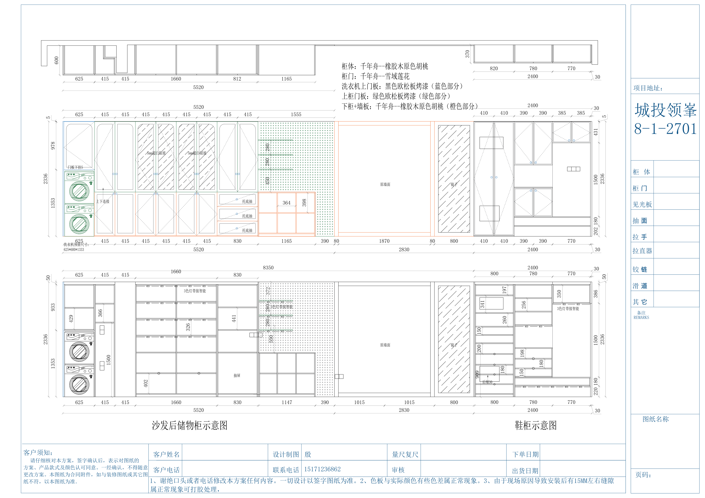

### 鞋柜建议分区

| 区域 | 放什么 | 原则 |
|---|---|---|
| 中部顺手区 | 当季常穿鞋、拖鞋、儿童外出鞋 | 每人固定 2-3 双，超出就收回柜内 |
| 底部区 | 儿童鞋、运动鞋、雨鞋 | 孩子能自己拿，培养出门自理 |
| 顶部/高柜 | 换季鞋、鞋盒、鞋护理套装 | 用透明鞋盒或标签盒 |
| 抽屉/小格 | 钥匙、门禁卡、口罩、纸巾、驱蚊贴 | 用小分格盒，避免堆成一团 |
| 侧边/竖格 | 雨伞、鞋拔、购物袋、快递刀 | 刀具高位或带安全锁 |

### 玄关必备小件

- 口罩/湿巾/纸巾小抽屉。
- 儿童水杯临时位。
- 快递拆包区：小剪刀、快递刀、胶带，建议成人高位。
- 回家消毒/擦手区：湿巾或免洗洗手液。
- 临时置物盘：钥匙、耳机、停车卡。

---

## 四、客厅 / 沙发后储物柜

### 适合放

- 客厅纸巾、遥控器备用电池、充电线。
- 桌游、拼图、亲子玩具。
- 黑板相关：粉笔、板擦、磁性字母、画画模板。
- 少量工具：卷尺、螺丝刀、备用灯泡。
- 客厅清洁：粘毛滚、桌面湿巾。

### 不建议放

- 大量零食：容易被孩子随手拿，且客厅会乱。
- 药品：建议放高位独立药箱。
- 重型工具：放在家政/工具箱更安全。

### 儿童黑板用品建议

用一个带提手的“黑板学习篮”：

- 无尘粉笔。
- 粉笔夹。
- 大号板擦。
- 磁性数字/字母/形状。
- 小抹布。

清洁喷雾单独放成人高位。

---

## 五、餐边柜 / 冰箱旁

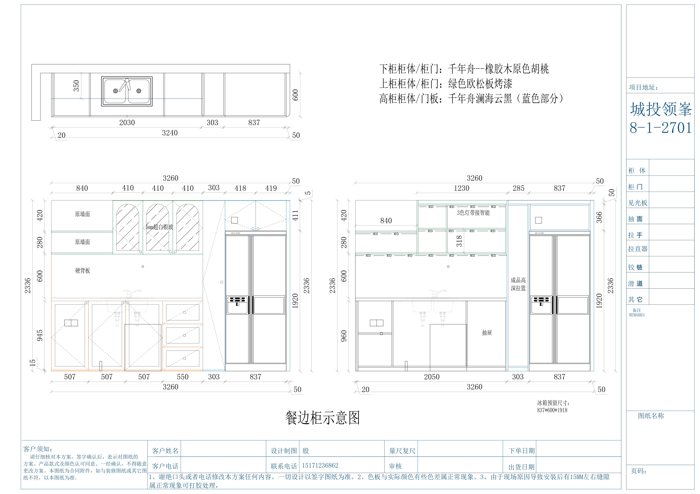

### 餐边柜主定位

餐边柜适合做“饮品 + 早餐 + 零食 + 备用餐具”的综合区。

| 区域 | 放什么 |
|---|---|
| 台面/开放区 | 咖啡机、热水壶、即饮水、杯架 |
| 中部顺手柜 | 茶叶、咖啡、儿童水杯、常用杯子 |
| 抽屉 | 吸管、餐垫、保鲜袋、一次性手套、开瓶器 |
| 下柜 | 小家电：空气炸锅、破壁机、早餐机 |
| 高柜 | 囤货饮料、酒、纸巾、节日餐具 |
| 冰箱旁 | 冰箱贴、购物清单、保鲜盒临时周转 |

### 餐边柜建议分三盒

- 早餐盒：麦片、面包袋夹、果酱、儿童早餐小零食。
- 饮品盒：茶包、咖啡胶囊、冲饮、蜂蜜。
- 外出盒：儿童水杯配件、吸管、便携餐具。

---

## 六、餐边柜对面储物柜

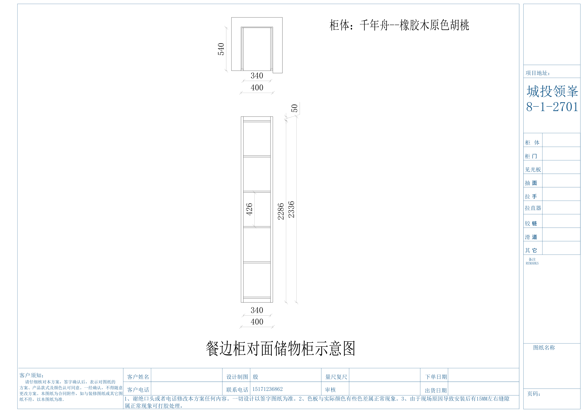

这个柜子建议作为“公共低频储物柜”，不要塞太日常的东西，否则全家都会来翻。

适合放：

- 家庭文件：合同、票据、保修卡、说明书。
- 备用日用品：纸巾、洗手液、垃圾袋、牙膏。
- 节日用品：红包、装饰、小礼品袋。
- 备用餐具/客用餐具。
- 亲子手工材料囤货。

建议工具：

- A4 文件盒 4-6 个。
- 透明收纳箱 2-4 个。
- 标签纸：`证件票据`、`家电说明书`、`保修卡`、`囤货`、`节日用品`。

---

## 七、主卧床尾衣柜

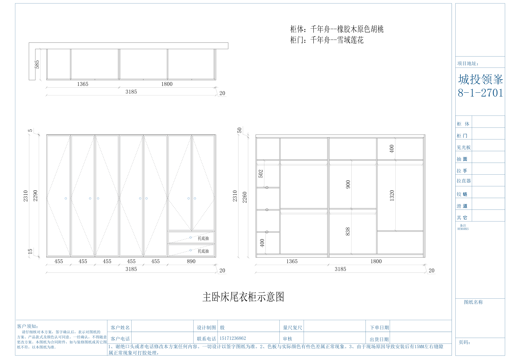

### 主卧床尾衣柜定位

这个柜体适合做主卧主要衣物和换季收纳。

| 区域 | 放什么 |
|---|---|
| 长挂区 | 大衣、连衣裙、西装、长款外套 |
| 短挂区 | 衬衫、T 恤、外套、裤子 |
| 抽屉 | 内衣、袜子、睡衣、围巾 |
| 下层 | 收纳箱、旅行包、常用行李袋 |
| 顶柜 | 被子、四件套、换季衣物 |

### 分类建议

- 左侧：男主人。
- 右侧：女主人。
- 中间抽屉：贴身衣物和配饰。
- 顶部：按季节装箱，箱外贴标签。

---

## 八、主卧床旁衣柜 / 梳妆台

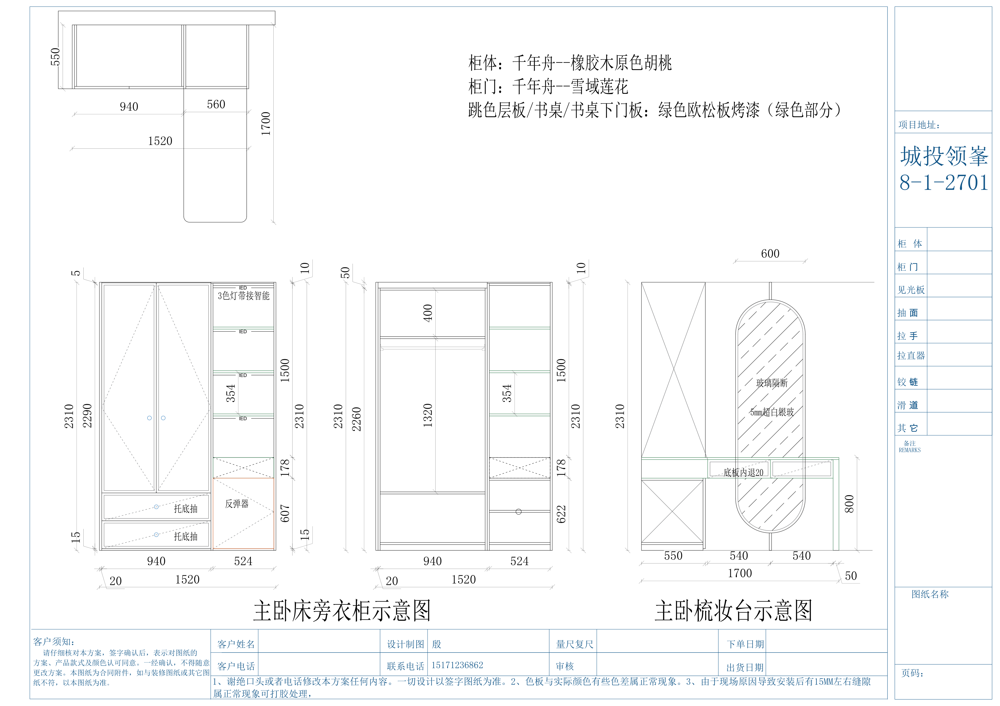

### 梳妆台建议

| 区域 | 放什么 |
|---|---|
| 桌面 | 每天用的护肤、镜子、纸巾 |
| 第一抽 | 口红、眉笔、粉扑、发夹 |
| 第二抽 | 面膜、备用护肤、旅行装 |
| 侧柜/高柜 | 吹风机、卷发棒、首饰盒 |

注意：

- 吹风机、卷发棒不要和水杯/湿巾混放。
- 首饰用分格盒，不要堆在抽屉里。
- 香水、精油、指甲油放孩子够不到的高位。

---

## 九、书房整体规划

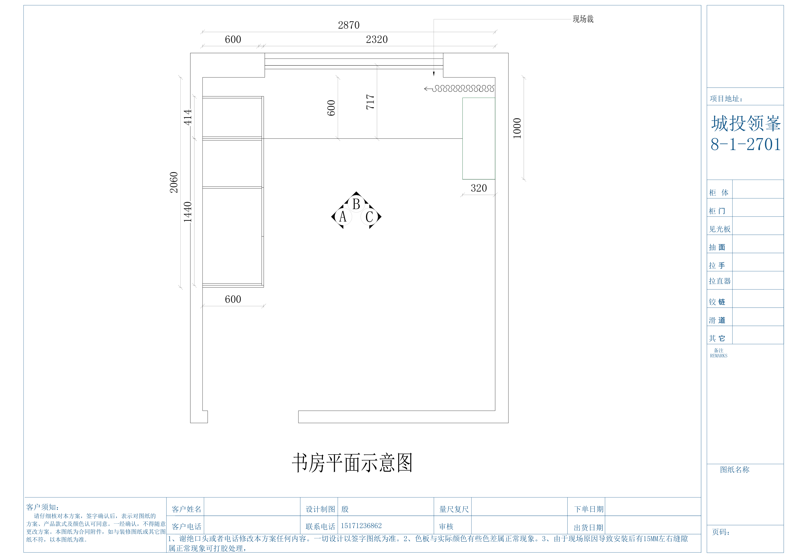

书房建议分成三个功能区：

1. 成人办公区。
2. 儿童学习陪伴区。
3. 家庭资料/书籍/打印耗材区。

---

## 十、书房 A 面

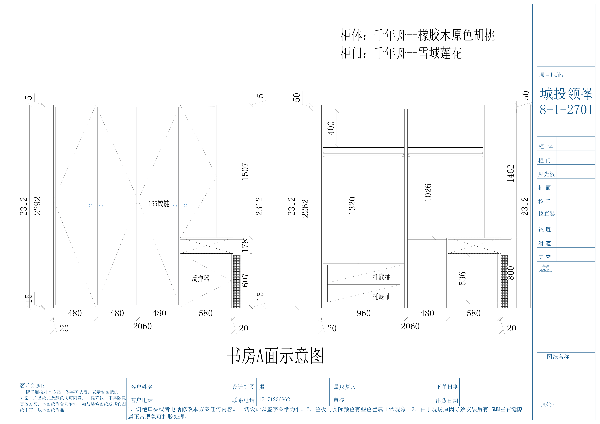

适合做“书籍 + 文件 + 常用办公用品”。

建议摆放：

- 中部：常看书、常用资料。
- 抽屉：笔、便利贴、剪刀、胶棒、订书机。
- 高柜：档案、证书、合同。
- 下柜：打印纸、儿童手工纸、备用文具。

儿童可达区：

- 绘本。
- 练习册。
- 彩笔。
- 拼图。

成人高位：

- 刀具、热熔胶枪、印章、证件。

---

## 十一、书房 B 面 / 书桌区

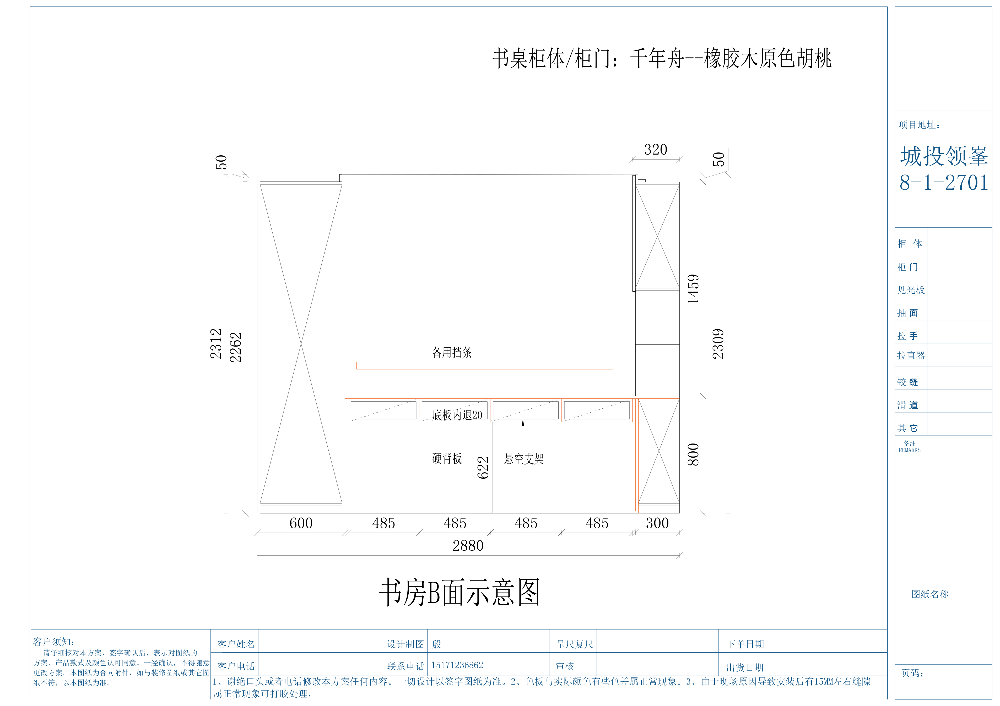

### 书桌台面原则

台面只留 5 类：

- 台灯。
- 电脑/显示器。
- 笔筒。
- 当天资料。
- 水杯。

其它都进抽屉或柜内。

### 抽屉建议

- 第一抽：每日文具。
- 第二抽：充电线、U 盘、耳机、鼠标垫。
- 第三抽：账本、票据、备用本子。

桌下不要长期堆纸箱，否则影响腿部空间和打扫。

---

## 十二、书房 C 面 / 展示与收纳

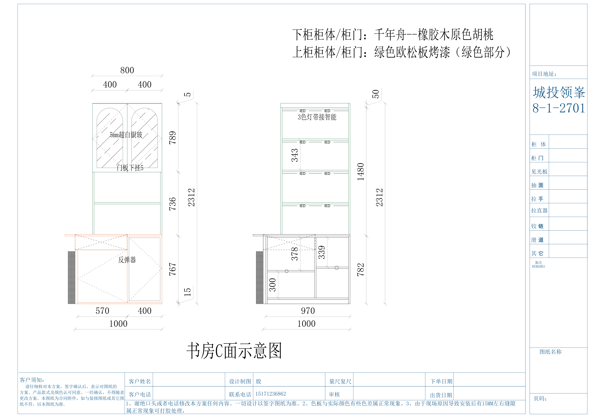

适合做“展示 + 少量封闭储物”。

开放/玻璃区：

- 乐高成品。
- 奖杯奖状。
- 收藏品。
- 少量好看的书。

封闭区：

- 玩具轮换箱。
- 教具。
- 不常用电子配件。
- 家庭备用文具。

建议给孩子设置一个“作品展示位”，每月替换一次，避免作品越堆越多。

---

## 十三、儿童房衣柜

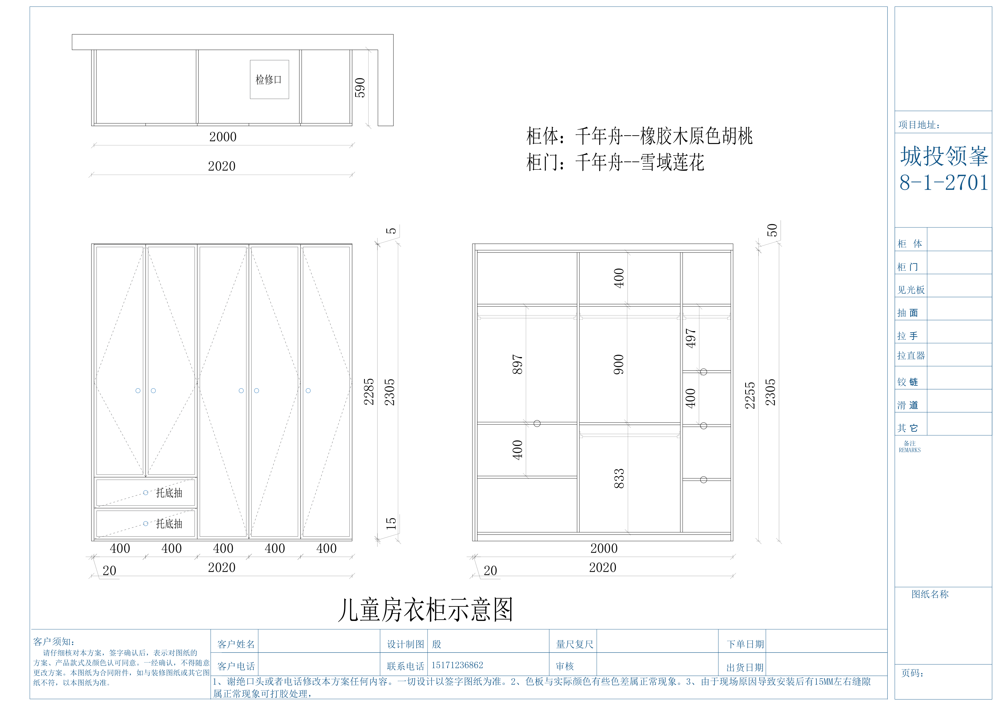

### 儿童衣柜建议

| 区域 | 放什么 |
|---|---|
| 孩子低位 | 常穿衣服、裤子、袜子、睡衣 |
| 中部挂区 | 校服、外套、连衣裙 |
| 抽屉 | 内衣、袜子、配饰 |
| 顶部 | 换季衣物、备用被褥、成长尺码衣服 |
| 下层 | 玩具轮换箱、书包、运动用品 |

### 儿童自主收纳法

不要按成人逻辑分太细，建议只分：

- 上衣。
- 裤子。
- 袜子内衣。
- 睡衣。
- 校园用品。
- 运动用品。

每个抽屉贴图标，比文字标签更适合小孩。

---

## 十四、厨房总规划

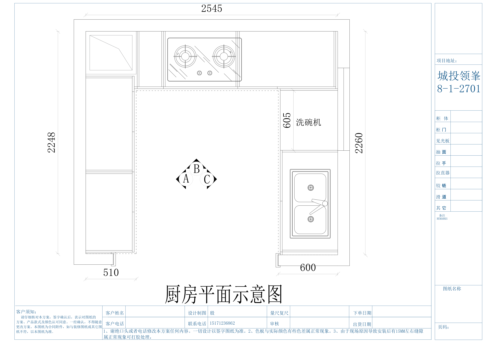

厨房按流程分：

1. 冰箱/取菜。
2. 水槽/清洗。
3. 切配。
4. 烹饪。
5. 装盘。
6. 洗碗机/收碗。

厨房收纳的核心是：重物下放、常用靠近操作点、调味靠近灶台、碗盘靠近洗碗机。

---

## 十五、厨房 A 面

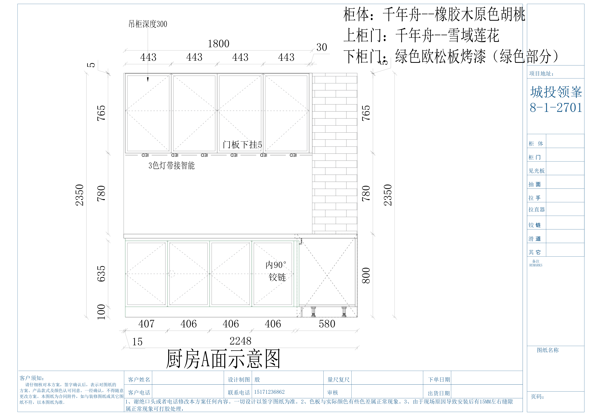

适合放：

- 吊柜：轻物、干货、备用杯盘。
- 下柜：锅具、烤盘、厨房小工具。
- 灯带下方操作区：切配工具、砧板、刀具。

建议：

- 刀具不要放儿童可达抽屉。
- 砧板竖放，保持通风。
- 干货用统一透明密封罐，标签写购买日期。

---

## 十六、厨房 B 面

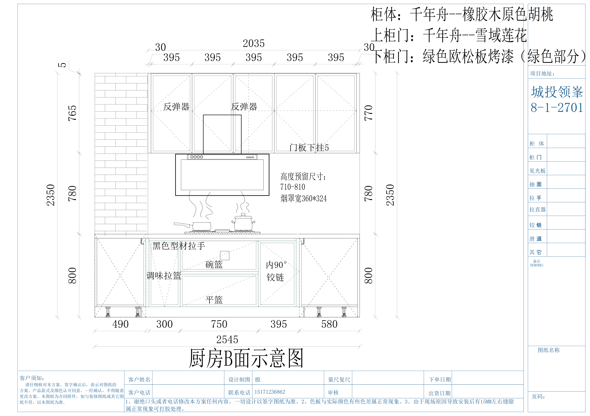

图纸里有碗篮、平篮、调味拉篮，建议这样放：

| 柜体/拉篮 | 放什么 |
|---|---|
| 碗篮 | 常用碗、盘、小碟 |
| 平篮 | 筷子、勺子、饭勺、锅铲 |
| 调味拉篮 | 油、盐、酱、醋、料酒、常用香料 |
| 灶台下柜 | 炒锅、汤锅、煎锅 |
| 吊柜 | 不常用调料、烘焙材料、备用餐具 |

调味建议：

- 每天用：放调味拉篮。
- 一周一次：放吊柜低位。
- 很少用：不要进厨房黄金位，放餐边柜囤货区。

---

## 十七、厨房 C 面 / 水槽 / 洗碗机

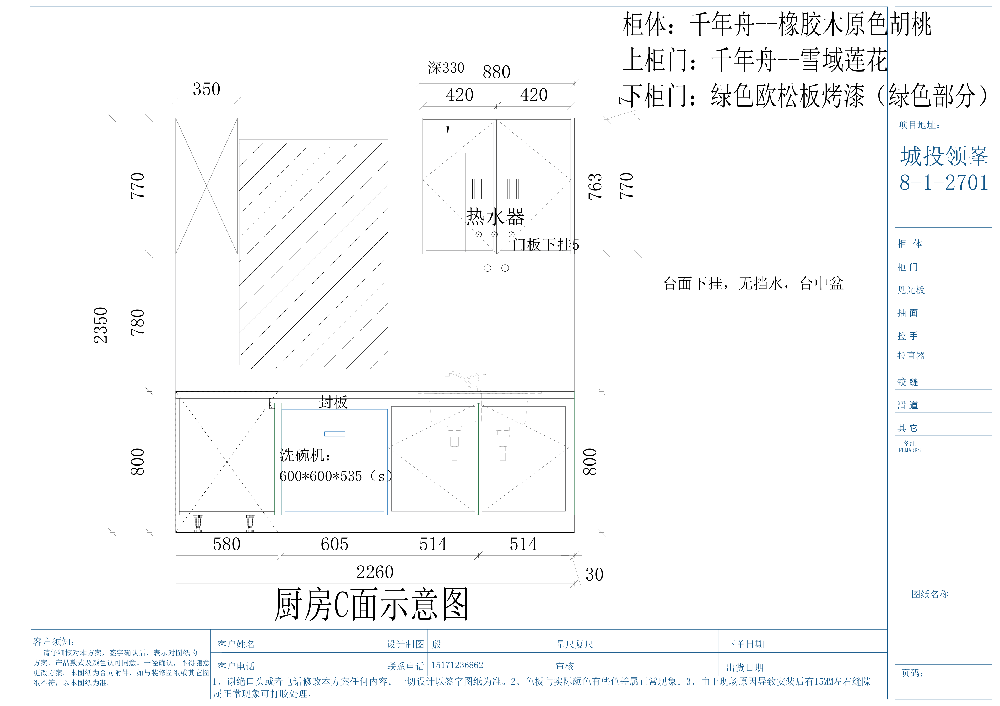

图纸包含洗碗机、热水器、水槽相关区域。

建议：

- 水槽下：垃圾袋、洗碗块、洗洁精补充装、过滤网、清洁刷。
- 洗碗机旁：洗碗粉/洗碗块、软水盐、亮碟剂。
- 水槽台面：只留洗洁精、海绵、手套。
- 热水器附近：不要堆易燃物、纸品和塑料袋。

水槽下建议加：

- 伸缩置物架。
- 防水垫。
- 小抽屉盒。
- 清洁剂分类盒。

---

## 十八、家政 / 洗衣区

图纸第 1 页提到洗衣机预留位，可作为洗衣和清洁补给区。

建议放：

- 洗衣液、柔顺剂、除菌液。
- 洗衣袋、内衣洗护袋。
- 衣架、夹子、粘毛器。
- 抹布、备用拖布头。
- 小工具箱。

注意：

- 洗衣液和清洁剂放孩子够不到的位置。
- 洗衣机上方柜不要放太重的东西。
- 抹布按用途分色：厨房、卫生间、地面、家具。

---

## 十九、搬家装箱标签系统

每个箱子贴三行：

```text
区域：厨房B面
类别：调味/锅具/餐具
优先级：A 当天用 / B 一周内 / C 换季低频
```

### 优先级建议

- A 箱：入住第一天必须用。牙刷、毛巾、换洗衣物、常用药、充电器、纸巾、垃圾袋、儿童睡衣、奶/水杯。
- B 箱：一周内会用。厨具、餐具、书包、常穿衣、洗护用品。
- C 箱：慢慢整理。换季衣物、纪念品、备用件、节日用品。

搬家当天先拆 A 箱，再拆厨房和卧室，最后拆书房和低频储物。

---

## 二十、建议购买的收纳工具

### 通用

- 标签机或防水标签纸。
- 透明收纳箱：中号为主，不建议全买大号。
- 抽屉分隔盒。
- A4 文件盒。
- 带提手收纳篮。
- 防滑垫、防水垫。

### 玄关

- 鞋盒或鞋托。
- 钥匙托盘。
- 口罩/纸巾小抽屉。
- 雨伞架。

### 餐边柜

- 茶包盒。
- 咖啡胶囊架。
- 零食透明盒。
- 杯架。

### 厨房

- 调料标签。
- 锅盖架。
- 砧板架。
- 水槽下伸缩架。
- 洗碗机耗材盒。
- 冰箱收纳盒。

### 书房/儿童区

- 绘本架。
- 文件盒。
- 文具分隔盒。
- 玩具轮换箱。
- 黑板学习篮。

---

## 二十一、入住后一周调整法

入住后不要第一天就追求完美。建议按这个节奏：

1. 第 1 天：床、洗漱、基础厨房、儿童睡眠。
2. 第 2-3 天：玄关、厨房、洗衣区。
3. 第 4-5 天：衣柜、儿童房。
4. 第 6-7 天：书房、餐边柜、低频储物。
5. 第 14 天复盘：把“不顺手”的东西移动到真实使用点附近。

判断一个位置是否合理，只看三个问题：

- 拿出来是否顺手？
- 用完是否愿意放回去？
- 家里其他人是否知道它在哪里？

如果三个答案都是“是”，这个位置就是好位置。
